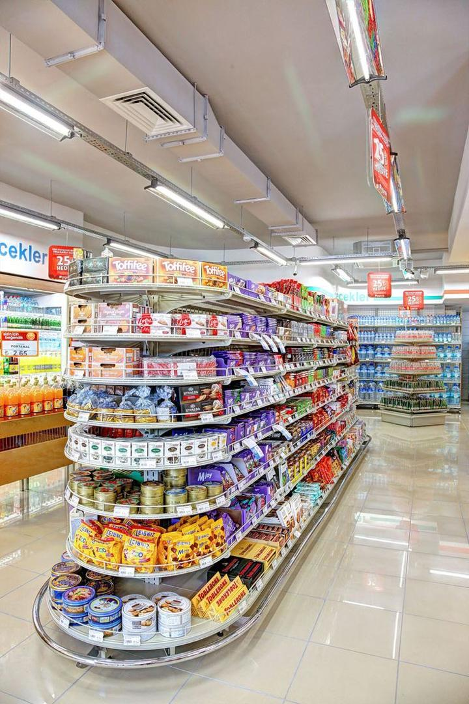
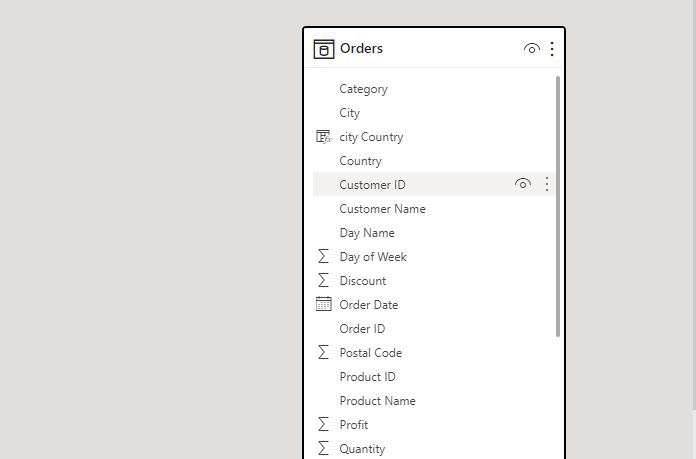
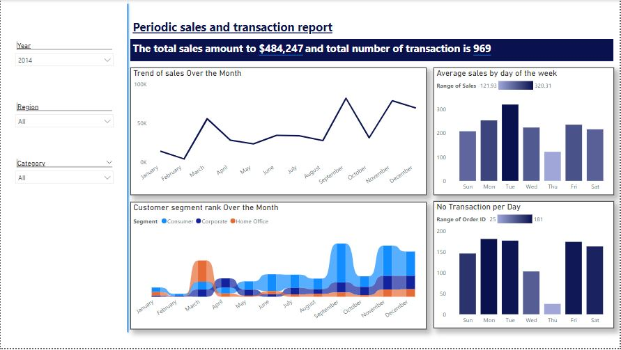

# Global Store Advannce Analysis

## Introduction

This is a power BI project on sales analysis of **Global Superstore**.
The headquartered is in New York, is an expansive online retailer offering over 10,000 products across three main categories: office supplies, furniture, and technology. Serving customers from 147 countries, its primary markets include the U.S., Australia, China, France, and Germany. In 2014, the company saw a revenue exceeding $4 million, marking a 26% increase from the previous year. Additionally, its order volume surged, processing over 17,000 orders in 2014.

**_ Data Source _** : _Global Super Store is a customer-centric data set that has around 50000 values. It has the data of all the orders that have been placed through different vendors and markets, starting from the year 2011 till 2015. It also has Salesman & Returns data.The data was gotten from Kaggle.com._

## Problem Statement
1.
2.
3.

## Skills/Concepts Demonstrated :

The following Power BI featurs were incorporated;
- Bookmarking,
- DAX,
- measures,
- Page Navigation,
- Modeling,
- Filters,
- Tooltips,
- Buttons

## Modelling
There is no model , its a sibnle table datasets

.

## Visulization

Periodic Report 

